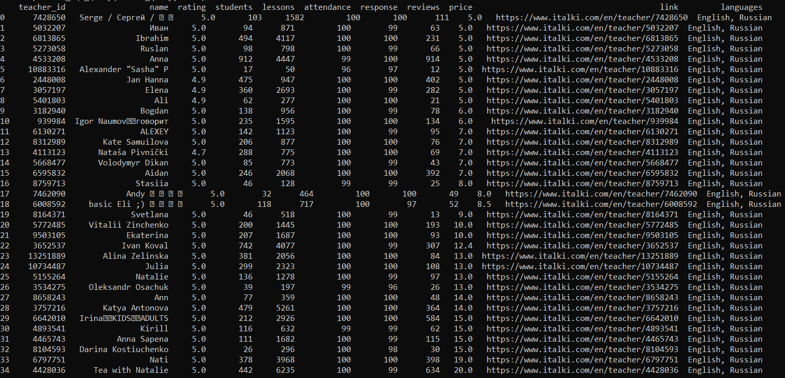

# Gleb Bikushev CA_2 (Data Architecture)

## How to run the project
1) Run database_setup.sql
```bash
psql -U username -d database_name -f database_setup.sql
```

This will create 3 tables in postgresql database: "teachers", "languages", "teachers_languages".

2) Run data_load.py
```bash
python data_load.py
```
This will scrap the data from https://www.italki.com/en/teachers/ for 5 languages ('English', 'Spanish', 'Russian', 'Japanese', 'Italian') and load collected info into postgresql tables.

Output should be like this:


## Description

The database is used to store data about teachers from website https://www.italki.com/en/teachers/ that teach following languages:
English, Spanish, Russian, Japanese, Italian

So, Supported languages: 'English', 'Spanish', 'Russian', 'Japanese', 'Italian'

The tables collectively provide comprehensive info about the teacher and languages he/she teach from Supported languages.

Datasets (tables) included in this project:
### 1) **"teachers"**: each row represents a unique teacher with all nessesary info about a teacher.

Columns are:

 - teacher_id: unique teacher id on the website www.italki.com that is extracted from teachers link to their personal card (type: bigint) (PRIMARY key).
 - name: The name of the teacher's card on the website (type: text).
 - rating: The rating of the teacher in the range from 0 to 5 (type: numeric(2,1)).
 - students: The number of students the teacher had (type: integer).
 - lessons: The number of lessons that the teacher has conducted (type: integer).
 - attendance: The percentage of classes the teacher has successfully attended without cancellations or no-shows 
 in the range from 0 to 100 (type: smallint).
 - response: The percentage of times the teacher replies to messages or lesson requests in the range from 0 to 100 (type: smallint).
 - reviews: The number of reviews the teacher has (type: integer).
 - price: The price for one Trial lesson in USD (type: numeric(5,2)).
 - link: The unique link on the teacher's personal card (type: text). 

### 2) **"languages"**: represents all languages that used for parsing teachers. So, these are the languages that extracted teachers teach.

Columns are:

 - language_id: unique id of language (type: VARCHAR(10)) (PRIMARY key)
 - language: unique language (type: language_type) 
 (language_type is custom categorical type, that can accept only Supported languages: 'English', 'Spanish', 'Russian', 'Japanese', 'Italian')

### 3) **"teachers_languages"**: connection table between "teachers" and "languages" to provide 3NF of database, so each teacher can teach one or multiple languages from Supported languages.

Columns are:

 - teachers_languages_id: unique id of each row (PRIMARY key)
 - teacher_id: FOREIGN key from table "teachers"
 - language_id FOREIGN key from table "languages"


## Links to data source

1) https://www.italki.com/en/teachers/english
2) https://www.italki.com/en/teachers/spanish
3) https://www.italki.com/en/teachers/russian
4) https://www.italki.com/en/teachers/japanese
5) https://www.italki.com/en/teachers/italian


## Specific outputs / Functionality

### 1) Output all teachers that teach {language} language with the ability to specify filter for teacher's rating,students,lessons,attendance,response,reviews,price.

Required:
 - query (1)
 - language (english by default)

Parameters can be specified:
 - rating [>,<,=,>=,<=] {rating}
 - students [>,<,=,>=,<=] {students}
 - lessons [>,<,=,>=,<=] {lessons}
 - attendance [>,<,=,>=,<=] {attendance}
 - response [>,<,=,>=,<=] {response}
 - reviews [>,<,=,>=,<=] {reviews}
 - price [>,<,=,>=,<=] {price}
 The operators [>,<,=,>=,<=] are applied to these values with special way(you have to specify sign and value in the quotation marks, check example of usage)
**Example 1:** 
```bash
python data_analysis.py --query=1 --language=english --rating=">=4.9" --lessons="<100" --price="<10.00" --price=">8.00"
```
(Selecting english language teachers with rating equals or more than 4.9, number of lessons taken less than 100 and price between 8 and 10 usd)


**Example 2:**
```bash
python data_analysis.py --query=1 --language=russian --rating="=5.0" --price="<=15" --reviews=">600"
```
(Selecting russian language teachers with rating equals 5.0, price equals or less than 15 and number of reviews more than 600)


### 2) Output all teachers that can teach all languages that are in specified list ordered by price.
Required:
 - query (2)
 - languages (english,russian by default)
 
**Example 1:**
```bash
python data_analysis.py --query=2 --languages=english,russian
```
(Output teachers who teach english and russian at the same time)



**Example 2:**
```bash
python data_analysis.py --query=2 --languages=english,russian,spanish
```
(Output teachers who teach english, russian and spanish at the same time)


### 3) Output top {limit} most paid {language} teachers.
Required:
 - query (3)
 - language (english by default)
 - limit (10 by default)

**Example 1:**
```bash
python data_analysis.py --query=3 --language=english --limit=10
```
(Output top 10 most paid english language teachers)


**Example 2:**
```bash
python data_analysis.py --query=3 --language=russian --limit=15
```
(Output top 15 most paid russian language teachers)


### 4) Output top {limit} {language} teachers with the most number of students they had.
Required:
 - query (4)
 - language (english by default)
 - limit (10 by default)

**Example 1:**
```bash
python data_analysis.py --query=4 --language=english --limit=10
```
(Output top 10 english language teachers with the greatest number of students they had)


**Example 2:**
```bash
python data_analysis.py --query=4 --language=russian --limit=5
```
(Output top 5 russian language teachers with the greatest number of students they had)

